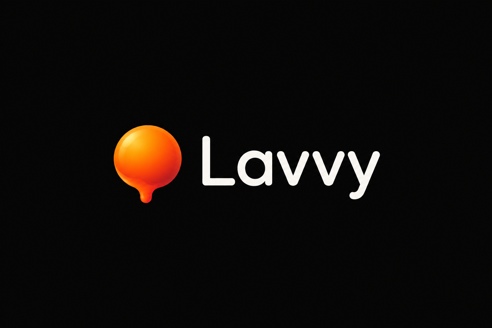

<p align="center">
  
</p>

<h1 align="center">Lavvy</h1>
<p align="center">
  <b>Minimalist Lavalink v4 client for Node.js</b><br/>
  
</p>

<p align="center">
  <a href="https://github.com/team-lavvy/Lavvy"></a>
  <a href="https://www.npmjs.com/package/lavvy"></a>
  <a href="https://github.com/team-lavvy/Lavvy/blob/main/LICENSE"></a>
</p>

---

## Features

- 🎵 **Full Lavalink v4 support** — WebSocket + REST, session resume
- ⚡ **Multi-node** — auto failover & least-load balancing
- 🎛️ **Audio filters** — bassboost, nightcore, vaporwave, tremolo, karaoke, rotation, distortion
- 📋 **Built-in queue** — add, remove, shuffle, clear, loop (track & queue)
- 🔌 **Plugin system** — extend with `lavvy.use(plugin)`
- 🪶 **Zero dependencies** — only Node.js built-ins
- 📦 **Tiny footprint** — clean, readable, minimal files

## Install

```bash
npm install lavvy
```

## Quick Start

```js
const { Client, GatewayIntentBits } = require('discord.js');
const { Lavvy } = require('lavvy');

const client = new Client({
  intents: [
    GatewayIntentBits.Guilds,
    GatewayIntentBits.GuildVoiceStates,
  ],
});

const lavvy = new Lavvy(client, [
  {
    name: 'Main',
    host: '127.0.0.1',
    port: 2333,
    password: 'youshallnotpass',
    secure: false,
  },
]);

client.on('ready', () => {
  lavvy.init(client.user.id);
  console.log(`${client.user.tag} is online with Lavvy!`);
});

// Forward raw gateway events for voice handling
client.on('raw', (d) => lavvy.updateVoiceState(d));

client.login('YOUR_BOT_TOKEN');
```

## Playing a Track

```js
async function play(guildId, voiceChannelId, query) {
  const player = lavvy.createPlayer({
    guildId,
    voiceChannelId,
    textChannelId: '...',
    selfDeaf: true,
  });

  await player.connect();

  const result = await lavvy.search(query);

  if (result.loadType === 'search') {
    const track = result.data[0];
    player.queue.add(track);
    await player.play();
  }
}
```

## Queue

```js
player.queue.add(track);          // add a track
player.queue.add(tracks);         // add multiple tracks
player.queue.add(track, 0);       // insert at position
player.queue.remove(2);           // remove by index
player.queue.shuffle();           // shuffle the queue
player.queue.clear();             // clear the queue
player.queue.setLoop('track');    // loop: 'off' | 'track' | 'queue'

player.queue.size;                // number of queued tracks
player.queue.current;             // currently playing track
player.queue.duration;            // total queue duration (ms)
```

## Player Controls

```js
await player.play(track);         // play a specific track
await player.play();              // play next from queue
await player.pause();             // pause playback
await player.resume();            // resume playback
await player.stop();              // stop current track
await player.seek(30000);         // seek to 30s
await player.setVolume(80);       // set volume (0-1000)
await player.destroy();           // destroy the player
```

## Audio Filters

```js
await player.filters.bassboost();     // bass boost
await player.filters.nightcore();     // nightcore
await player.filters.vaporwave();     // vaporwave
await player.filters.tremolo();       // tremolo
await player.filters.karaoke();       // karaoke
await player.filters.rotation();      // 8D rotation
await player.filters.distortion();    // distortion
await player.filters.reset();         // reset all filters

// Custom equalizer
await player.filters.equalizer([
  { band: 0, gain: 0.5 },
  { band: 1, gain: 0.3 },
]);
```

## Events

```js
lavvy.on('nodeConnect', (node) => {
  console.log(`Node ${node.name} connected`);
});

lavvy.on('nodeDisconnect', (node) => {
  console.log(`Node ${node.name} disconnected`);
});

lavvy.on('trackStart', (player, track) => {
  console.log(`Now playing: ${track.info.title}`);
});

lavvy.on('trackEnd', (player, track, reason) => {
  console.log(`Track ended: ${reason}`);
});

lavvy.on('queueEnd', (player) => {
  console.log('Queue finished');
});

lavvy.on('trackError', (player, track, error) => {
  console.error('Track error:', error.message);
});

lavvy.on('trackStuck', (player, track, threshold) => {
  console.warn(`Track stuck for ${threshold}ms`);
});

lavvy.on('playerCreate', (player) => { /* ... */ });
lavvy.on('playerDestroy', (player) => { /* ... */ });
lavvy.on('nodeError', (node, error) => { /* ... */ });
lavvy.on('nodeReconnect', (node, attempt) => { /* ... */ });
```

## Plugins

```js
const myPlugin = {
  init(lavvy) {
    lavvy.on('trackStart', (player, track) => {
      console.log(`[Plugin] ${track.info.title}`);
    });
  },
};

lavvy.use(myPlugin);
```

## REST API

Each node exposes the full Lavalink v4 REST API:

```js
const node = lavvy.idealNode();

await node.rest.loadTracks('ytsearch:never gonna give you up');
await node.rest.decodeTrack(encodedTrack);
await node.rest.getInfo();
await node.rest.getStats();
await node.rest.getRoutePlannerStatus();
```

## Multi-Node Setup

```js
const lavvy = new Lavvy(client, [
  { name: 'US-East', host: 'us-east.example.com', port: 2333, password: 'pass1' },
  { name: 'EU-West', host: 'eu-west.example.com', port: 2333, password: 'pass2' },
]);
```

Lavvy automatically selects the node with the lowest load. If a node goes down, players are migrated to the next best available node.

## Structure

```
src/
├── Lavvy.js       # Main client — node management, voice state, plugins
├── Node.js        # WebSocket + REST per Lavalink node
├── Player.js      # Player controls per guild
├── Queue.js       # Queue management with loop support
└── Filters.js     # Audio filter presets
index.js           # Package entry point
```

## Requirements

- **Node.js** ≥ 18.0.0
- **Lavalink** v4

## License

[MIT](LICENSE)

---

<p align="center">
  
  <br/>
  <sub>Built with 💜 by <a href="https://github.com/team-lavvy">team-lavvy</a></sub>
</p>